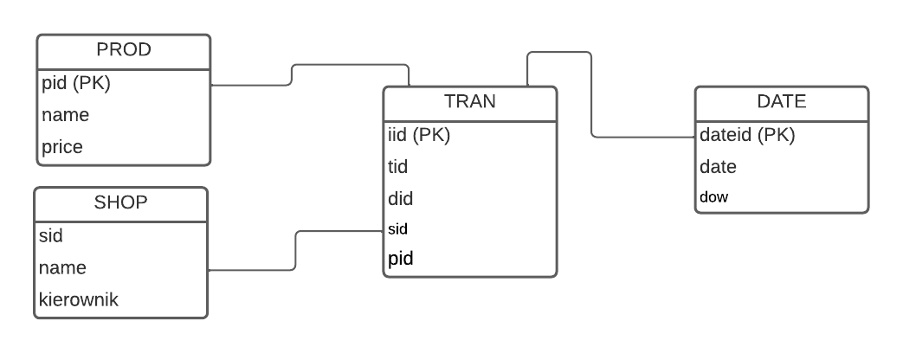

```{r setup, include=FALSE}
knitr::opts_chunk$set(echo = TRUE)
```

## Wstęp

Dane dotyczą transakcji, a każda transakcja dotyczy zbioru produktów. 
Chcemy wyznaczyć produkty często kupowane razem.

Oznaczmy przez `P` zbiór produktów `P = {P1, P2, ..., Pn}`.
**Regułą asocjacyjną** nazwiemy parę `L→R`, przy czym `L`,`R` 
to podzbiory zbioru `P`.
Ktoś kto kupił kiełbasę kupił 
także musztardę i ketchup (`kiełbasa → {musztarda,ketchup}`.)
Prościej się nie da:-)

Reguł postaci `L→R` można wygenerować dowolnie wiele, 
ale nie każde są użyteczne. Potrzebne są kryteria użyteczności.

**Support** (wsparcie) określa jak często
zdarza się reguła `LR`. To iloraz liczby transakcji 
zawierających regułę `LR` do liczby wszystkich transakcji. Jeżeli transakcji
`kiełbasa → {mleko sojowe}` jest bardzo mało,
to nie mają one większego praktycznego znaczenia (przypadek)

**Confidence** (wiarygodność), czyli procent `LR/L` czyli ile transakcji kupna
kiełbasy skończyło się kupnem musztardy i ketchupu. Oczywiście interesują nas
reguły o dużej wiarygodności. Jeżeli w analizowanym zbiorze
transakcji było 2000 zawierających kiełbasę oraz 1500 kiełbasę,
musztardę i ketchup to 
wiarygodność reguły (`kiełbasa → {musztarda,ketchup}` wynosi 75%.


**Lift** (podniesienie), wsparcie `LR` do iloczynu wsparcia `L` oraz `R` (iloczyn
wspracia `L` oraz `R` odpowiada sytuacji gdy `L`/`R` są niezależne);
Jeżeli lift =1 to nie ma związku między `L` i `R`; jeżeli lift > 1 to `L` zwiększa
szanse na `R`; 
jeżeli lift < 1 to `L` zmniejsza szanse na `R`.

## Przykład

Baza danych `mbo.db` zawiera *toy example* hurtowni danych składającej się
dokładnie z 4 tabel. Tabela `TRANS` to tabela faktów (pozycje z paragonów); tabele
`SHOP`, `PROD`, `DATE` to wymiary:



Baza dla utrudnienia jest w formacie `SQLite`. Należy dane wydobyć i złączyć. 
Konkretnie do danych z tablicy `TRANS` (`iid` oraz `tid` -- identyfikator paragonu) 
dodać nazwy produktów
(`name`) żeby całość była bardziej czytelna. 
Tutaj od razu do akcji wkracza język programowania R. Korzystamy
z dwóch bibliotek `arules` do wyznaczania reguł asocjacyjnych
oraz `RSQLite` do komunikowania się z SQLite:


```{r, message=F}
library("arules")
library(RSQLite)

## Łączenie się z bazą z pliku mbo.db
myDB <- "mbo.db"
conn <- dbConnect(drv = SQLite(), dbname= myDB)

## lista sklepów na rozgrzewkę
## shops <- dbGetQuery(conn, "SELECT *  FROM shop")

## lista pozycji (złączenie tablei TRANS z PROD)
items <- dbGetQuery(conn, "SELECT iid, tid, name  FROM tran 
                    inner join prod on tran.pid=prod.pid")

## zamykamy bazę
dbDisconnect(conn)
```

W tym momencie ramka `items` zawiera dane niezbędne do analizy:

```{r}
translist <- split (items$name, items$tid, "transactions")
rul <- apriori(translist, parameter = list(support=0.005, 
                                           confidence=0.5, maxlen=10, minlen=2))
inspect(rul)
```

albo ładniej:

```{r }
bjuty_rules <- DATAFRAME(rul)
library("knitr")
kable(bjuty_rules, col.names = c('L', 'R', 'wsparcie', 'wiarygodność', 'coverage',
                                 'lift', 'n'))
```

koniec analizy...