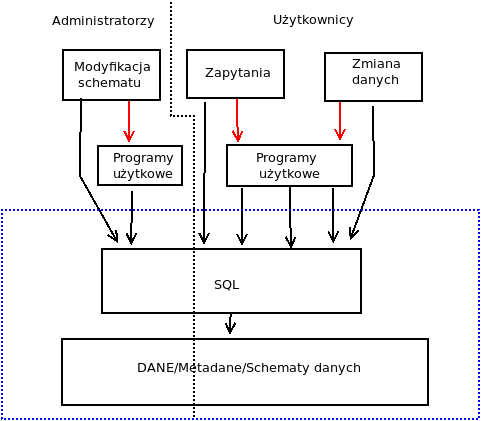
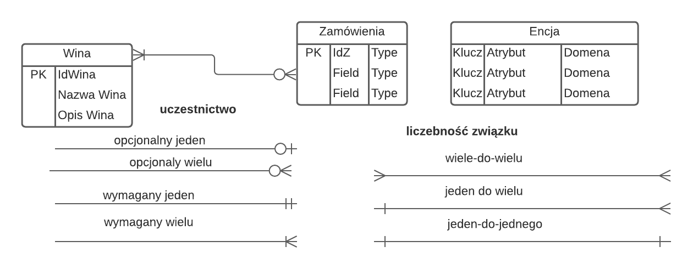
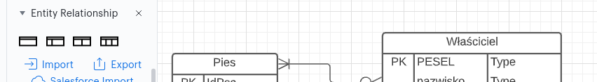
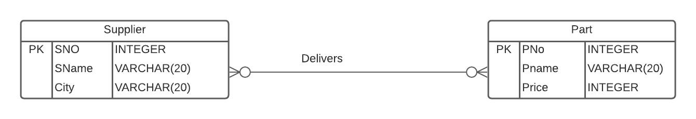
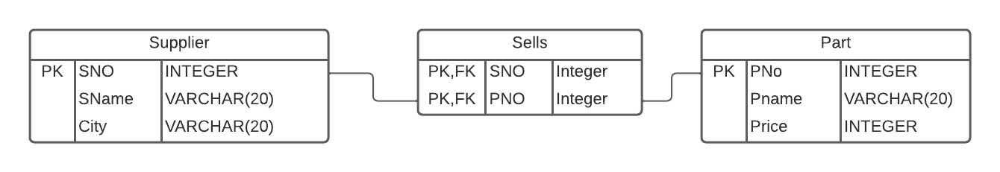
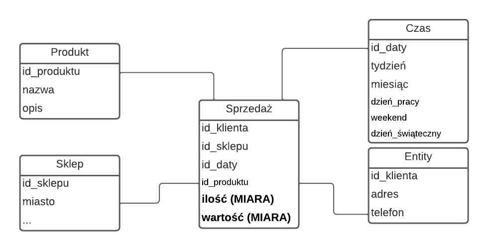
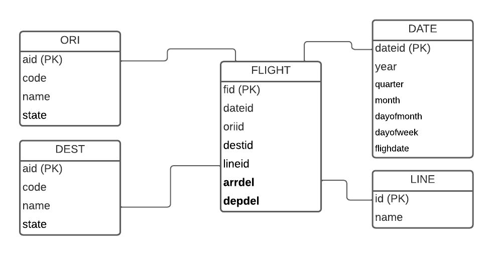

```{r setup, include=FALSE}
knitr::opts_chunk$set(echo = TRUE)
```

## Wprowadzenie, podstawowe informacje

Systemy baz danych: dziedzina informatyki zajmująca się gromadzeniem,
przechowywaniem, wyszukiwaniem i przetwarzaniem danych. Poniżej kilka
definicji co to jest baza danych:

* zbiór danych istniejący przez długi czas, często przez
wiele lat. Zwykle oznacza jednak zbiór danych zarządzany przez system
zarządzania bazą danych (DBMS vel Database management system).

* zasób pamiętanych danych operacyjnych wykorzystywanych przez systemy
użytkowe pewnego przedsiębiorstwa (Date).

* zasoby danych w pamięci o wielkiej pojemności zapewniające dotarcie do
poszczególnych elementów wg różnych kryteriów (Leksykon)

* zasób wzajemnie powiązanych danych pamiętanych bez redundancji
służących jednemu lub wielu zastosowaniom w sposób optymalny dane są
pamiętane w taki sposób,że są niezależne od programów przy dołączaniu
i modyfikacji stosuje się wspólną metodę umożliwiającą sprawdzanie
poprawności wykonywanych operacji (Martin).

System baz danych: Baza danych + System zarządzania bazą danych

Baza danych składa się ze schematu bazy danych oraz ze zbioru danych.

**System zarządzania bazą danych umożliwia:**

* zdefiniowanie i modyfikację schematu bazy,

* zakładanie i usuwanie bazy, 

* wprowadzanie danych, wyszukiwanie danych,
aktualizację (modyfikowanie, usuwanie) danych. 


**System zarządzania bazą danych potrafi**:

* przechowywać ogromne ilości danych (co najmniej gigabajty; wyklucza
przetwarzanie w pamięci operacyjnej), przez długi czas, chroniąc je
przed przypadkowym lub niepowołanym dostępem oraz umożliwia
efektywny (czytaj szybki) dostęp do danych.

* zarządzać **jednoczesnym dostępem** 
do danych przez wielu użytkowników, z zapewnieniem bezkolizyjności
oraz ochrony danych przed uszkodzeniem 
(dwóch użytkowniów nie zmodyfikuje
**na raz** tych samych danych).


**System zarządzania bazą danych cechuje**:

* Integralność; Dokładne odzwierciedlenie rzeczywistości, której baza
danych jest modelem poprzez procedury badania poprawności danych przy
wykonywaniu operacji na bazie danych i dokonywanie bieżących zmian

* Niezależność danych; 
Organizacja danych jest niewidoczna dla użytkowników i programów;
Zmiana SZBD nie wymaga zmiany/modyfikacji bazy danych
(Oddzielenie danych od procesów)

* Minimalna redundancja;
Każdy element danych jest zarejestrowany tylko raz w jednym miejscu,
natomiast może być wykorzystany w wielu zastosowaniach

* Bezpieczeństwo danych; Dla zachowania integralności bazy danych
niezbędne jest jej zabezpieczenie, ograniczenie dostępu; określić
należy zbiór upoważnionych użytkowników w odniesieniu do całej lub
części bazy danych

SZBD używa do w/w celów języka baz danych: języka opisu danych (DDL)
oraz języka operowania danymi (DML) lub językiem zapytań.

Standardem współcześnie jest relacyjny SZDB; w którym
podstawową strukturą przechowywania danych jest relacja (tabela).
W wielkim uproszczeniu schemat takiego (relacyjnego) SZDB
przedstawia schemat:




Standardem DDL/DML relacyjnych SZBD jest język SQL. 
Jak widać na schemacie
administratorzy bazy/użytkownicy mogą komunikować się z bazą bezpośrednio
używając SQL lub (zwykle) za pomocą aplikacji pośredniczących (programów użytkowych) typu
*wpisz-i-kliknij*. Taka aplikacja zamienia
to co wpisał użytkownik/administrator na na stosowne polecenia języka SQL.

Tematem zajęć (w uproszczeniu) będzie to co jest zakreślone niebieskim prostokątem.
Nie będziemy tworzyć programów użytkowych ani
zajmować się tym jak się takie programy projektuje. Tematem
zajęć będą
podstawowe zasady tworzenia relacyjnej 
bazy danych oraz podstawy języka SQL na przykładzie najprostrzego
bodajże SZBD o nazwie SQLite.

## Podstawowe założenia modelu relacyjnego

Relacyjna baza danych jest zbiorem **relacji**.
Relacja jest dwuwymiarową tabelą, złożoną z kolumn (pól)
i wierszy (rekordów) o następujących właściwościach:

* Wszystkie dane zapisane są w postaci tabel.

* Liczba tabel w bazie jest z góry ustalona; nazwa każdej tabeli jest
unikalna w obszarze bazy.

* Liczba kolumn w tabeli jest z góry ustalona; nazwa każdej kolumny jest
unikalna w obszarze tabeli.

* Z każdą kolumną jest związana jej dziedzina, określająca zbiór
wartości, jakie mogą pojawić się w kolumnie.

* Na przecięciu wiersza i kolumny znajduje się pojedyncza (atomowa)
wartość należąca do dziedziny kolumny.

* Liczba wierszy nie jest z góry ustalona; tabela nie może zawierać
identycznych wierszy.

* Kolejność wierszy i kolumn w tabeli nie ma znaczenia
(Inaczej mówiąc numer kolumny/wiersza nie zawiera żadnej informacji)

* Dla każdej tabeli musi być określony jednoznaczny identyfikator,
nazywany **kluczem głównym**, czyli jedna lub więcej kolumn, w których
wartości jednoznacznie identyfikują cały wiersz. 

* Klucz jednoznaczny (nazywany też **kluczem alternatywnym**, lub w skrócie kluczem) ma tę samą
właściwość, co klucz główny, przy czym klucz główny jest tylko jeden,
a kluczy jednoznacznych w tabeli może być wiele.

* **Klucz obcy** jest to jedna lub więcej kolumn, których wartości
występują, jako wartości ustalonego klucza głównego lub jednoznacznego
innej (lub w tej samej) tabeli i są interpretowane, jako wskaźniki do
wierszy w tej drugiej tabeli.

* Dziedziny kolumn mogą zawierać specjalną wartość NULL oznaczającą brak wartości.

* **Więzy integralności** (spójności) danych, są to warunki poprawności
stawiane wobec danych przechowywanych w bazie. Celem ich działania
jest zagwarantowanie logicznej spójności danych. Więzy są definiowane
na etapie projektowania bazy danych, a za ich przestrzeganie odpowiada
system bazy danych.

## Projektowanie baz danych

Fazy projektowania DB: **analiza wymagań**, **projektowanie koncepcyjne**,
   **projektowanie fizyczne**
 

• **Analiza wymagań**

Projektanci baz danych przeprowadzają wywiady
z potencjalnymi użytkownikami i interesariuszami (stakeholders)

Wymagania dotyczące danych (data requirements)
opisują gromadzone dane

Wymagania funkcjonalne (functional requirements)
opisują operacje wykonywane na danych

Analiza funkcjonalna dotyczy operacji/transakcji wysokiego poziomu


• **Projektowanie koncepcyjne (conceptual design)**

* Przekształca wymagania dotyczące danych w model koncepcyjny
* Model koncepcyjny opisuje encje danych, relacje,
ograniczenia itp. na wysokim poziomie
* Nie zawiera żadnych szczegółów implementacji
* Niezależność od używanego oprogramowania i sprzętu

• **Projektowanie logiczne (logical design)**

* Odwzorowuje koncepcyjny model danych na logiczny
 model danych używany przez DBMS,  np. model relacyjny, model hierarchiczny, ...
 
* Model koncepcyjny niezależny od technologii jest dostosowany
do używanego DBMS

• **Projektowanie fizyczne**

* Tworzenie strukturur potrzebnych do sprawnego przechowywania/zarządzania
  danymi w konkretnym DBMS (Zależy od używanego sprzętu i oprogramowania DBMS)

• **Przykład: DBA dla Bank of America**

* Specyfikacja wymagań
  Określ wymagania klientów (Baza danych do
przechowywać informacje o klientach, rachunkach, pożyczkach,
oddziały, transakcje, ...)

*  Projekt koncepcyjny
 Wyraź wymagania klienta w zakresie modelu E/R; 
 Potwierdź z klientami, że wymagania są prawidłowe;
 Określ wymagane operacje na danych
 
*  Logiczny projekt
 Konwertuj model E/R na relacyjny, lub inny

• Projekt fizyczny
  Wykonaj konkretny system np z wykorzystaniem SQLite


## Modelowanie ER (ER Modeling)

Tradycyjne podejście do modelowania koncepcyjnego

Entity-relationship models (stąd modele ER albo diagramy ER czyli ERD);

Reprezentacja graficzna; Podejście top-down (od ogółu do szczegółu);
wymyślona w 1976 roku przez Petera Chena.

Encje (*entity*), Atrybuty (*attributes*), Związki/Relacje (relations),
Więzy spójności (*Constraints*)


Encja to wyróżniony obiekt ze świata rzeczywistego;
opisany za pomocą zbioru atrybutów. Np. właściciel psa

Zbiór encji (**entity set**) to
zbiór encji o identycznym zbiorze atrybutów (właściciele psów;
albo konkretny właściel psa to encja a każdy właściciel psa to
zbiór encji).

**Atrybut** to właściwość zbioru encji (lub związku), przykładowo
właściciel psa ma PESEL, nazwisko i adres korespodencyjny (trzy atrybuty).

Każdy atrybut ma domenę (dopuszczalny zbiór wartości), np. nazwisko
jest ciągiem znaków alfanumerycznych

**Związek** to zależność dowolnej natury pomiędzy
dwoma lub więcej encjami (zbiorami encji). Może też mieć
atrybuty. Np. pies ma właściela

**Liczebność związku**

* **jeden do jeden** (1:1), np. pies ma jednego właściciela a właściciel 
  ma jednego psa 

* **jeden do wiele** (1:N), np.
  pies ma jednego właściciela; właściciel może mieć wiele psów

* **wiele do wiele** (N:M), np.
  pies może mieć wielu właścicieli; właściciel może mieć wiele psów


**Uczestnictwo w związku**

* **wymagane**, gdy każda instancja encji musi brać udział w związku

* **opcjonalne**, gdy chociaż jedna encja nie musi brać udziału w związku

**Więzy spójności** (*integrity constraints* w języku informatycznym
albo business rules/reguły biznesowe tak w ogóle) to dodatkowe
warunki nakładane na encje/atrybuty.  Np. każdy pies 
musi mieć co najmniej jednego właściciela (albo dokładnie jednego)

Diagram ER reprezentuje **schemat** bazy tj. sposób w jaki dane są
przechowywane. W bazie danych encjom będą odpowiadały krotki (wiersze),
a atrybutom kolumny.
Tabela będzie jest zbiorem encji tego samego typu (tej samej
klasy).

Spośród atrybutów należy wybrać jeden lub kilka jednoznacznie
identyfikujące encje tej samej klasy (klucz)

Między encjami `pies` i `właściciel` (w wersji że pies ma tylko jednego
właściciela) zachodzi następujący związek:
właściciel może mieć wiele psów, pies może mieć jednego
właściciela. Jest to związek jeden do wiele, któremu w bazie danych odpowiada 
klucz główny po stronie jeden (`właściciel`) 
i klucz obcy po stronie wiele (`pies`)

Między encjami `pies` i `właściciel` (w wersji że pies może mieć wielu właścicieli) zachodzi następujący związek:
właściciel może mieć wiele psów, pies może mieć wielu
właścicieli. Jest to związek wiele do wiele, który
wymaga utworzenia dodatkowej tabeli, np. `pies-właściciel`. Tabela
`pies-właściciel` ma klucz główny (złożony) 
`id_psa` + `id_właciciela` po stronie jeden
oraz `id_psa`/`id_właściciela` w tabelach `pies` i `właściciel` 
po stronie wiele.

## Podstawy diagramów ER 

Z istniejących wiele sposóbów diagramów ER. Opiszemy tylko
jeden zwany 
notacją Martina (https://pl.wikipedia.org/wiki/Notacja_Martina)


W zasadzie wszystko widać. Encja może być określona bez atrybutów
z podaniem atrybutów lub z podaniem atrybutów, kluczy 
i domen atrybutów.

**Przekształcenie diagramu w schemat relacyjnej bazy danych**:

* Dla każdej encji tworzona jest tabela

* Identyfikatory encji stają się kluczami głównymi tabel

* Atrybuty stają się atrybutami relacji (nagłówkami kolumn tabeli)

* Związki jeden do wiele realizowane są za pomocą klucza
obcego w tabeli po stronie wiele

* Związek jeden do jeden można zrealizować za pomocą klucza
obcego plus ograniczenie UNIQUE po stronie wiele

* Opcjonalność po stronie wiele można kontrolować dodając lub
nie ograniczenie NOT NULL

* W lepszych programach odbywa się to automatycznie, np. w aplikacji LucidChart wystarczy nacisnąć ikonę `Export`:



Wynik w zależności od stopnia precyzji diagramu może 
wymagać *ręcznej* poprawki/uzupełnienia/doprecyzowania.

Entity Relationship Diagram (ERD) Tutorial 
w programie LucidChart (https://www.youtube.com/watch?v=QpdhBUYk7Kk)

## Normalizacja

Anomalie danych

**redundancja** (nadmiarowość) – przechowywania tej samej informacji w
kilku krotkach

**anomalia wprowadzania** – wprowadzenie pewnej informacji wymaga
jednoczesnego wprowadzenia innej informacji

**anomalia modyfikacji** – modyfikacja informacji dokonywana jest w
pewnych krotkach a w innych nie

**anomalia usuwania** – usunięcie części informacji powoduje utracenie innych informacji

Anomalie danych -- przykład:

```
Sklep     Adres                 Artykuł Cena
Żabka     ul. Czarnowiejska 37  masło   3.80
Lewiatan  ul. Mazowiecka 28     masło   4.00
Jubilat   ul. Głowackiego 30    mleko   2.50
Żabka     ul. Czarnowiejska 37  mleko   2.70
```

* redundancja – adresy i nazwy sklepów występują wielokrotnie

* anomalia wprowadzania – wprowadzenie artykułu wymaga wprowadzenia
adresu sklepu

* anomalia modyfikacji – zmiana adresu sklepu musi być wprowadzana we
wszystkich krotkach

* anomalia usuwania – usunięcie wszystkich artykułów danego sklepu
powoduje usunięcie wszystkich danych sklepu

Relacja jest matematycznym pojęciem abstrakcyjnym odpowiadającym
tabeli w relacyjnym modelu danych. Schematem relacji nazywamy:

```
R = {A1, A2, ... An}
```

gdzie `A1`, `A2`, ... `An` są atrybutami (nazwami kolumn); każdemu
atrybutowi  `A` przyporządkowana jest  dziedzina `D(A)` czyli
zbiór dopuszczalnych wartości dla atrybutu `A`.


Krotka (*tuple*) to wiersz w tabeli danych.

Relacja `r` o schemacie `R={A1, A2, ... An}` spełnia
**zależność funkcyjną** `X → Y`  (gdzie `X`, `Y` są
podzbiorami (atrybutów) `R`),  jeżeli dla każdych dwóch krotek (wierszy)
`p`, `q` spełniony jest warunek: jeżeli `p[X] = p[Y]` to `q[X] = q[Y]`;
czyli
wartości zbioru atrybutów `X` determinują jednoznacznie wartości
atrybutów `Y` (ale nie odwrotnie)

**Nadkluczem** relacji `r` o schemacie `R={A1, A2, ... An}`
nazywamy każdy dowolny zbiór atrybutów `X` z `R`, taki że
`X → R`. Powyższe oznacza, że wartości atrybutów `X`
jednoznacznie identyfikują wszystkie krotki relacji `r`
o schemacie `R`. Innymi słowy, w żadnej relacji `r` o
schemacie `R` nie istnieją dwie krotki `p`, `q` takie, że `q[X] = p[X]`.
Jednym z nadkluczy jest cały wiersz oczywiście.

**Kluczem** relacji `r` o schemacie `R={A1, A2, ... An}`
nazywamy każdy **minimalny nadklucz**, tj taki który nie zawiera w sobie
żadnego innego nadklucz w sensie że usunięcie z niego atrybutu skutkuje
tym że przestaje identyfikować wiersz.

atrybut `A` jest podstawowy w
schemacie `R` jeżeli należy do któregokolwiek z kluczy
schematu `R`; atrybut `A` jest **wtórny** w schemacie `R`
jeżeli nie należy do żadnego z kluczy schematu `R`

Pierwsza postać normalna: schemat relacji `R` znajduje się
w pierwszej postaci
normalnej(1NF), jeżeli wartości  atrybutów są atomowe
(niepodzielne)

```
+--------------------------------------------------------+
| Faktura/Numer: 123/15   Data: 2015-09-20               |
| NumerKlienta: 125    Nazwa: Zakład Mechaniczny Tamech  |
| Adres klienta: Kwidzyn, ul. Fabryczna 5                |
+--------------------------------------------------------+
| Numer Kod towaru         Nazwa   Cena Ilość Wartość    |
+--------------------------------------------------------+
| 1      SM210          śruba M10   30   2     60        |
| 2      PM210      podkładka M10   30   1     30        |
| 3      NM210       nakrętka M10   35   2     70        |
+--------------------------------------------------------+
| Suma 160                                               |
+--------------------------------------------------------+
```

Faktura znormalizowana do 1NF

```
Faktura = {#Nr_faktury,  Data, NumerKlienta, Nazwa, Adres,
  Nr Kod_towaru, Nazwa_towaru, Cena, Ilość, Wartość, Suma }
```

Zależność funkcyjna (FD)
Dana jest relacja `r` o schemacie `R`. `X`, `Y` są podzbiorami
atrybutów `R`. W schemacie relacji `R`,
`Y` **jest funkcyjnie zależny** od `X`, co
zapisujemy `X → Y`, wtedy i tylko wtedy, jeżeli dla dwóch
dowolnych krotek `p`, `q` takich że `p[X] = q[X]`
zachodzi `p[Y] = q[Y]`.

Zbiór atrybutów `Y` jest **w pełni** funkcyjnie zależny od zbioru atrybutów
`X` w schemacie `R`, jeżeli `X → Y` i nie istnieje podzbiór
`X’ ⊂ X` taki, że `X’ → Y`

Zbiór atrybutów `Y` jest częściowo funkcyjnie zależny od zbioru
atrybutów `X` w schemacie `R`,
jeżeli `X → Y` i istnieje podzbiór
`X’ ⊂ X` taki, że `X’ → Y`.

**Druga postać normalna**: Dana relacja `r` o schemacie `R` jest
w drugiej postaci normalnej (2NF),
jeżeli żaden **atrybut wtórny** tej relacji nie jest częściowo funkcyjnie
zależny od żadnego z kluczy relacji `r`. 

Rozważmy następujący przykład ilustrujący definicję drugiej postaci normalnej.
Dana
jest relacja `Uczestnictwo` składająca się z atrybutów:
`IdPrac`, `NrProj`, `Funkcja`, `Nazwisko`, `NazwaProj`, `Lokalizacja`:

```
Uczestnictwo = {IdPrac, NrProj, Funkcja, Nazwisko, NazwaProj, Lokalizacja}
```

Relacja `Uczestnictwo` opisuje udział pracowników
o identyfikatorze (`IdPrac`) w realizacji projektów o numerze `NrProj`.
Kluczem schematu
relacji `Uczestnictwo` jest para atrybutów `IdPrac` i `NrProj`.

Zauważmy, że w schemacie relacji `Uczestnictwo` występuje
7 zależności funkcyjnych `fd1`, ..., `fd7`.
Rozpatrujemy tylko zależności pomiędzy kluczami złożonymi (dwie lub więcej
kolumn.) Zależności `fd2`, `fd3`, `fd4` są zależnościami niepełnymi

```
fd1: {IdPrac, NrProj} → Funkcja
fd2: {IdPrac, NrProj} → Nazwisko
fd3: {IdPrac, NrProj} → NazwaProj
fd4: {IdPrac, NrProj} → Lokalizacja
fd5: {IdPrac} → Nazwisko
fd6: {NrProj} → NazwaProj
fd7: {NrProj} → Lokalizacja
```

Zależności `fd2`, `fd3`, `fd4` są zależnościami niepełnymi.
Przykładowo, zależność funkcyjna
`fd2: {IdPrac, NrProj} → Nazwisko` jest częściową zależnością
funkcyjną gdyż istnieje podzbiór lewej strony zależności funkcyjnej
(`IdPrac`), który
wyznacza funkcyjnie prawą stronę zależności.
Podobnie jest w przypadku zależności
`fd3` i `fd4`. Łatwo zauważyć, że schemat relacji uczestnictwo
nie jest w 2NF, gdyż
istnieją atrybuty wtórne (Nazwisko, NazwaProj, Lokalizacja), które są częściowo
zależne od klucza.

tabele powinny przechowywać informacje o tylko jednej *rzeczy*,
opisywaną w całości przez jej klucz główny

tabela będąca w 1NF może nie być w 2NF tylko jeśli posiada złożony
klucz główny

```
----------------
# Numer faktury
Data wystawienia
Nr klienta
Nazwa klienta
Adres klienta
Suma

----------------
# Numer faktury
# Numer pozycji
Kod towaru
Nazwa
Cena
Ilość
Wartość
```

**Trzecia postać normalna**:

Dana relacja `r` o schemacie `R` jest w trzeciej postaci
normalnej (3NF), jeżeli dla każdej zależności funkcyjnej
`X → A` w `R` spełniony jest jeden z następujących
warunków: – `X` jest nadkluczem schematu `R`, lub
– `A` jest atrybutem podstawowym schematu `R`

Relacja jest w trzeciej postaci normalnej wtedy i tylko wtedy, gdy
jest w drugiej postaci normalnej
i każdy niekluczowy atrybut jest
bezpośrednio, a nie przechodnio, zależny od klucza głównego.

```
----------------
# Numer faktury
Data wystawienia
Nr klienta
Suma

----------------
# Numer faktury
# Numer pozycji
Kod towaru
Ilość
Wartość

---------------
# Nr klienta
Nazwa klienta
Adres klienta

---------------
# Kod towaru
Nazwa
Cena
```

## SQL

Jak wspomnianio we wstępie, standard zarządzania relacyjnymi
bazami danych. Do ćwiczeń z SQL będziemy używali programu `sqlite3`,
który należy uruchomić w oknie terminala (cmd) systemu Windows:

```
sqlite3 nazwa-bazy-danych.db
```
Jeżeli `nazwa-bazy-danych.db` istnieje to `sqlite` ją otworzy;
jeżeli nie istnieje to `sqlite` nic nie otworzy,
ale jeżeli podczas pracy z `sqlite` jakaś baza powstanie, to do tego
pliku zostanie zapisana

W tymże `sqlite3` polecenia wpisujemy z klawiatury, a naciskając `<ENTER>`
powodujemy ich wykonanie. W ten sposób działamy w trybie 
*jedno-polecenie-na-raz*. Można też wpisać 
od razu wiele poleceń w jakimś edytorze typu `Notatnik`,
a potem wydając polecenie:

```
.read plik.sql
```

Spowodować ich wykonanie przez system SQLite. Na etapie nauki
niewątpliwie należy korzystać z trybu *jedno-polecenie-na-raz*. 
A jak
już wszystko działa i jest sprawdzone to można to zapisać do pliku
i wykonać przez `.read`.

#### Przykład

Załóżmy że baza `wina0.db` nie istnieje (nie ma takiego pliku). 
Wydajemy z poziomu terminala (`cmd`) polecenie:

```
sqlite3 wina0.db

```

System zgłosi się czymś w rodzaju:

```
SQLite version 3.27.2 2019-02-25 16:06:06
Enter ".help" for usage hints.
sqlite> 
```

Wpisujemy teraz (bez błędów i starannie; znaków `...>` nie wpisujemy
po naciśnięciu `ENTER` same się pojawią, jest to symbol kontynuuacji polecenia; `CREATE TABLE wina (`  nie jest kompletnym poleceniem i jeżeli
naciśniemy `ENTER` to system przejdzie do nowego wiersza ale dalej
będzie w trybie wpisywania polecenia co sygnalizuje symbolem `...>`):

```
sqlite>  CREATE TABLE wina ( 
   ...>   id INTEGER, 
   ...>   name CHAR(20),
   ...>   primary key (id));
sqlite> 
```
Wpisanie ostatniego wiersza zakończonego średnikiem spowoduje
wykonanie całego polecenia. Jeżeli nie popełniliśmy błędów
`sqlite3` zgłosi się znakiem `>` co będzie oznaczało, że wszystko
wykonał poprawnie. Powyższe polecenie oznacza utworzenie (pustej tabeli
o nazwie `wina`; więcej na ten temat dalej.) Teraz zakończmy
pracę z `sqlite3`:

```
.q
```

W katalogu pojawił się plik `wina0.db` zawierający pustą
tabelę `wina` utworzoną przed chwilą...

### SQL podstawowe informacje

Język SQL nie rozróżnia małych i wielkich liter w słowach kluczowych i
nazwach (baz danych, tabel, indeksów i kolumn); często dotyczy to też
wartości napisowych. Poprawne są nazwy zbudowane ze znaków
alfanumerycznych, nie zaczynające się od cyfry.

Dwa znaki `--` zaczynają komentarz, który kończy się z końcem
wiersz; Sekwencja znaków `/* ... */` też oznacza komentarz który
może zawierać się w wielu wierszach:

```
-- komentarz jedno wierszowy
/** wypisze wiersze dla pname równych:
    tryb i sztyca
**/
```

Serwer MySQL może równocześnie zarządzać wieloma bazami danych, każdą
z nich identyfikuje nazwa. W trakcie trwania połączenia z serwerem
MySQL baza bieżąca, to taka do której domyślnie odnoszą się polecenia
adresujące tabele. Odniesienia do kolumn mogą być postaci: `kolumna`,
`tabela.kolumna`, `bazadanych.tabela.kolumna`, `tabela@bazadanych.kolumna`.
 
Każde polecenie SQL kończy się średnikiem;

Wartości napisowe podaje się tak: `"napis"`, lub tak: `'napis'`. Znaki
`%` i `@` są metaznakami, służącymi do tworzenia wzorców do porównań;
oznaczają odpowiednio dowolny ciąg znaków i dowolny jeden znak. Aby
zostały przekazane dosłownie, należy je poprzedzać metaznakiem `\`.

**Uwaga**: fragmenty oznaczone jako ☠☠ można pominąć! Na fragmenty oznaczone
jako 〠〠 należy zwrócić szczególną uwagę.

### Definicja danych 〠〠

Do utworzenia tabeli służy instrukcja `CREATE TABLE`, wymagająca
podania nazwy tworzonej tabeli, nazwy każdej kolumny w tej tabeli,
typu danych kolumn oraz maksymalnej długości danych w kolumnie.

Standard ISO SQL (1992) przewiduje około piętnastu typów danych,
podzielonych na grupy:

Typy napisowe (*String*): np. `CHAR(N)`, `VARCHAR(N)`.  `CHAR(N)`
definiuje pole napisowe o stałej długości (ew. uzupełniane spacjami),
podczas gdy `VARCHAR(N)` jest polem o zmiennej długości nie
przekraczającej `N`.

Typy liczbowe (*Numeric*): np.  `INT`, `BIGINT`,
`FLOAT`, `DECIMAL`.  Na ogół dostępnych jest wiele różnych typów
liczbowych, różniących się możliwym zakresem wartości (`INT`, 
`BIGINT`, `SMALLINT`, ...)  i precyzją (`FLOAT`, `DOUBLE PRECISION`, ...).
Typ `DECIMAL(M,D)` to liczba (ułamek)
dziesiętny o ustalonej liczbie cyfr dziesiętnych w części całkowitej 
i ułamkowej.

Typy daty i godziny (*Datetime*): np. `DATE`, `TIME`, `TIMESTAMP`.

Bogactwo dostępnych typów danych i możliwość określania długości
należy wykorzystywać do optymalizowania definicji tabeli pod kątem
zużycia miejsca i do kontroli integralności wprowadzanych (bądź
wynikających z operacji na danych) wartości.


Składnia polecenia `CREATE TABLE` (w uproszczeniu) jest następująca
(`[...]` oznacza opcjonalną część polecenia):

```
CREATE TABLE nazwa.tabeli
(nazwa.kolumny1 typ.danych[(długość) opcje],
   ... 
 nazwa.kolumnyN typ.danych[(długość) opcje],
   [opcje.tabeli])
```

Opcje, które mogą wystąpić po określeniu typu i długości danych to,
np. `NULL`, `NOT NULL`, `PRIMARY KEY`, `UNIQUE`,
`DEFAULT wartość.domyślna`, i inne.

Opcje mogące wystąpić w definicji kolumny w instrukcji
`CREATE TABLE` dzielą się na opcje ogólne, które mogą być stosowane do
(prawie) wszystkich typów kolumn, i opcje szczególne, stosujące się do
niektórych (klas) typów.  Niektóre z opcji wykluczają się wzajemnie,
np. `PRIMARY KEY` i `NULL`.

#### Opcje dotyczące wszystkich typów

* `PRIMARY KEY`: określa daną kolumnę jako klucz główny tabeli. 
Tabela może posiadać tylko (co najwyżej) jeden klucz główny, o
wartościach nie powtarzających się i różnych od `NULL`.

* `DEFAULT wartość.domyślna`: określa wartość domyślną kolumny
dla nowo wprowadzanych wierszy w przypadku, gdy instrukcja tworząca
nowy wiersz nie zadaje tej wartości.

* `NOT NULL` lub `NULL`: określa, czy `NULL` jest dopuszczalną
wartością w tej kolumnie.  Domyślnie wartość `NULL` jest
dopuszczalna, za wyjątkiem kluczy (kolumn indeksowanych).

* `AUTO.INCREMENT`: jeżeli przy tworzeniu wiersza nie zada się
jawnie wartości dla tej kolumny to wartością zapisaną będzie
największa z wcześniej występujących w tej kolumnie 
powiększona o jeden.

#### Opcje tabeli

W ciągu definicji kolumn w instrukcji `CREATE TABLE` mogą być
ponadto umieszczone dodatkowe deklaracje, służące głównie do
deklarowania indeksów, w tym kluczy złożonych (indeksów obejmujących
więcej niż jedną kolumnę). Są one postaci:

* `PRIMARY KEY (nazwa.kolumny.indeksowej, ...)`: określenie klucza głównego.

* `KEY [nazwa.indeksu] (nazwa.kolumny.indeksowej, ..)`: deklaruje
indeksowanie ze względu na wartości z odpowiednich kolumn. 

* `INDEX [nazwa.indeksu] (nazwa.kolumny.indeksowej, ...)`: synonimem dla `KEY`.

* `UNIQUE [nazwa.indeksu] (nazwa.kolumny.indeksowej, ...)`: 
deklaruje indeks o nie powtarzających się wartościach.


#### Przykład:

Mamy prostą bazę składającą się tabel: 
dostawcy (`SUPPLIER`), części (`PART`) oraz dostawy (`SELLS`):

Diagram (*Supplier delivers Part*) Dostawca może dostarczać
wiele części; ta sama część może być dostarczana przez wielu dostawców.



Schemat bazy. Że związek pomiędzy dostawcą a częścią jest wiele-do-wielu
trzeba utworzyć ekstra tabelę:




Polecenia `SQL` definiujące schemat bazy:

```
CREATE TABLE SUPPLIER (
  SNO INTEGER not null, 
  SNAME VARCHAR(20), 
  CITY  VARCHAR(20), 
primary key (sno));

CREATE TABLE PART (
  PNO INTEGER not null,  
  PNAME VARCHAR(20), 
  PRICE DECIMAL(6, 2), 
  primary key (pno));

CREATE TABLE SELLS (
  SNO INTEGER, 
  PNO INTEGER, 
  primary key (pno, sno));
```

### Usuwanie tabel

Tabele można usunąć za pomocą instrukcji:

```
DROP TABLE [IF EXISTS] tabela
```

#### Przykład

```
DROP TABLE if EXISTS SUPPLIER;
```

### Modyfikacja struktury tabel ☠☠

Strukturę tabel już istniejących (i wypełnionych danymi) można
modyfikować, w sensie dodawania lub usuwania kolumn i indeksów, zmiany
definicji kolumn, czy wreszcie zmiany nazwy tabeli.  Operacja ta jest
w zasadzie bezpieczna, nawet jeżeli tabela jest w danej chwili w
użyciu.  Oczywiście kłopoty mogą powstać, jeżeli dane już zapisane w
tabeli nie mieszczą się w nowych definicjach typów kolumn.

```
ALTER [IGNORE] TABLE nazwa.tabeli operacja1[, operacja2, ...]
```

### Wprowadzanie danych: LOAD DATA ☠☠

```
LOAD DATA INFILE 'plik' [ REPLACE | IGNORE ] INTO TABLE tabela
[ FIELDS [ TERMINATED BY '\t', [ OPTIONALLY ] ENCLOSED BY '' ESCAPED BY '\\' ]]
[ LINES TERMINATED BY '\n' ] [(pole1, pole2, ...)]
```

### Instrukcja INSERT 〠〠

W najprostszej postaci instrukcja `INSERT` służy wprowadzeniu do
tabeli pojedynczego wiersza danych:

```
INSERT INTO tabela [ (kolumna1, ...) ] VALUES (wyrażenie1, ...) 
```

Jeżeli nazwy kolumn, do których wstawiamy wartości podanych wyrażeń
nie zostaną podane jawnie, to wartości te zostaną wpisane do kolejnych
kolumn w takim porządku, w jakim kolumny te były zdefiniowane
(instrukcją `CREATE TABLE`. 
Pola danych w tych kolumnach, dla których
nie podano wartości otrzymają wartości domyślne (zdefiniowane jawnie w
instrukcji `CREATE TABLE` lub automatyczne, np. napis pusty dla pól
napisowych). Szczególne zachowanie dotyczy kolumn zadeklarowanych jako
`AUTO_INCREMENT` (co wspomniano wcześniej), 
oraz typu `TIMESTAMP` -- w tym
ostatnim przypadku pole kolumny otrzyma wartość odpowiadającą czasowi
operacji, o ile nie podamy jawnie innej wartości (innej niż NULL).

#### Przykład

```
INSERT INTO PART VALUES (1,'szprycha',0.50);
INSERT INTO PART VALUES (2,'felga Rigida',40.00);
INSERT INTO PART VALUES (3,'felga Vuelta',45.00);
```

### Usuwanie wierszy: instrukcja DELETE

Do usuwania wiersza bądź wierszy z tabeli służy instrukcja
`DELETE`. Specyfikacji wierszy, które mają być usunięte służy klauzula
`WHERE`:

Ogólną postać wyrażeń, których można użyć w charakterze warunków
omówimy nieco dalej. W najprostszym przypadku można po prostu użyć
warunku żądającego, by wartość w określonej kolumnie była równa
podanej stałej, np.

```
-- uswa z PART wszystkie wiersze w których kolumna PNAME = 'łańcuch'
DELETE FROM PART WHERE PNAME = 'łańcuch'
```

Jeżeli chcemy mieć pewność, że usunięty
zostanie tylko jeden określony wiersz, to warunek powinien dotyczyć
wartości klucza głównego lub jakiegoś klucza zadeklarowanego jako
`UNIQUE`.

### Budowa wyrażeń w SQL

Wyrażenia te podlegają ewaluacji przez instrukcję `SELECT`, oraz
służą do formułowania warunków podawanych w klauzuli `WHERE`
instrukcji takich, jak `DELETE` czy `UPDATE`. Aby więc
sprawdzić, jaki jest wynik ewaluacji danego wyrażenia, można wpisać w
linii komend `sqlite` instrukcję `SELECT wyrażenie`

```
-- kalkulator w SQL oblicz pole koła o promieniu 4:
SELECT 3.1415 * 4 * 4 
```
 
### Porównania

Zgodnie z oczekiwaniami: `=`(równość), `<` (mniejszy),
`>` (większy), `<>` (albo `!=` różny), `<=` (mniejszy lub równy),
`>=` (większy lub równy)

Jeżeli wartością któregokolwiek z argumentów porównania 
jest `NULL`, porównanie  zwraca jako wynik `NULL`
(oczywiście za wyjątkiem funkcji `ISNULL`.)

```
-- wypisze wiersze dla price > 99 
select * from PART where  price > 99;
-- wypisze wiersze dla pname = 'łańcuch'
select * from PART where  pname = 'łańcuch';
```

### Porównania napisów

Porównania napisów są nieco bardziej skomplikowane. 
Standard SQL definiuje pewną mocno uproszczoną wersję wyrażeń regularnych, 
z wykorzystaniem metaznaków `%` oraz `_` 
do porównywania wyrażeń za pomocą operatora `LIKE` (p. poniżej); 
lecz ponadto MySQL umożliwia porównania z wykorzystaniem 
pełnej składni wyrażeń regularnych (operator REGEXP).

`wyrażenie IN (wartość1, ...)`: zwraca jedynkę jeżeli wyrażenie jest
równe którejkolwiek wartości z listy podanej w nawiasach, w przeciwnym
wypadku zwraca zero. Wartość wyrażenia może być numeryczna, a jej typ
narzuca sposób porównania.

`wyrażenie NOT IN (wartość1, ...)`: równoważne `NOT`
(wyrażenie `IN (wartość1, ...)`).

```
-- wypisze wiersze dla pname równych tryb i sztyca
select * from PART where  pname in ('tryb', 'sztyca');
```

`wyrażenie1 LIKE wyrażenie2`: porównanie wzorców, w których budowie
można korzystać z metaznaków \% (oznaczającego dowolną liczbę -- w tym
zero -- dowolnych znaków), oraz `_` (oznaczającego dowolny pojedynczy
znak). Aby we wzorcu umieścić któryś z metaznaków jako znak dosłowny,
należy go poprzedzić znakiem `\`.

`wyrażenie1 NOT LIKE wyrażenie2`: 
równoważne `NOT (wyrażenie1 LIKE wyrażenie2)`.

```
-- wypisze wiersze z pname zaczynające się od felga
select * from PART where  pname like 'felga%';
```

`wyrażenie1 REGEXP wyrażenie2`: 
porównanie wzorców zbudowanych zgodnie ze składnią wyrażeń regularnych. 

`wyrażenie1 NOT REGEXP wyrażenie2`: 
równoważne `NOT (wyrażenie1 REGEXP wyrażenie2)`.

`STRCMP(napis1, napis2)`: zwraca zero jeżeli napisy są jednakowe,
minus jeden jeżeli pierwszy argument jest wcześniejszy według
obowiązującego porządku sortowania, a w przeciwnym wypadku -- plus
jeden.

#### Wyrażenia logiczne

Każda wartość różna od zera i NULL odpowiada w wyrażeniu logicznym
prawdzie; a więc `NULL` i zero reprezentują wartość ,,fałsz''. 
Operatory logiczne: `NOT` (negacja),
`OR` (alternatywa), `AND` (koniunkcja.)

```
-- wypisz wszystkie części których nazwy nie zaczynają się od felga
select * from PART where  pname NOT LIKE 'felga%';
-- jak wyżej ale tylko te których cena jest mniejsza od 99
select * from PART where  pname NOT LIKE 'felga%' and PRICE < 99;

-- wypisz wszystkie części, których cena <= 50 LUB >= od 100
select * from PART where  PRICE <= 50 OR PRICE >= 99;
```

### Wyrażenia arytmetyczne

Proste operatory arytmetyczne to dodawanie (`+`), odejmowanie (`-`),
mnożenie (`*`) i dzielenie (`/`). Wynikiem dzielenia przez zero jest `NULL`).

Ponadto w SQL dostępny jest zestaw funkcji
matematycznych (wykładnicze, logarytmiczne, trygonometryczne itp.).
W kokretnej implementacji SQLa mogą być dostępne różne funkcje.

### Wyrażenia napisowe ☠☠

SQL udostępnia także funcje do manipulowania napisami; jakie
konkretnie to zależy od wersji SQLa. W przypadku SQLite nie jest
ich specjalnie  dużo 
https://www.sqlitetutorial.net/sqlite-string-functions/

### Instrukcja SELECT 〠〠

Instrukcja `SELECT` służy głównie do pobierania danych z tabeli (tabel)
na podstawie zadanych warunków. Wynikiem jej wykonania 
jest zawsze tabela. Składnia tej instrukcji jest
złożona, dlatego omówimy ją na przykładach:

```
SELECT wyrażenie1, wyrażenie2, ... 
```

Tym razem wynikiem będzie tabela o jednym wierszu i o kolumnach
zawierających kolejno wartości podanych wyrażeń.

```
SELECT wyrażenie1, wyrażenie2, ... FROM tabela 
```

W takiej postaci instrukcji `SELECT` sygnalizujemy, że dane chcemy
pobierać z tabeli wymienionej po słowie kluczowym `FROM`. Możemy teraz,
budując wyrażenia, używać nazw kolumn z tej tabeli. Kolejność kolumn w
tabeli wynikowej będzie taka, jak kolejność podanych wyrażeń. W
szczególności, wyrażenia mogą być po prostu nazwami interesujących nas
kolumn. Szczególny przypadek to

```
SELECT * FROM tabela 
```

co spowoduje wypisanie całej tabeli.

```
SELECT wyrażenie1, wyrażenie2, ... FROM tabela WHERE warunek 
```

Warunek podany po słowie kluczowym WHERE ogranicza działanie
instrukcji SELECT do wierszy spełniających ten warunek. Powinien on
być wyrażeniem logicznym, zbudowanym z wykorzystaniem nazw kolumn
tabeli.

### Złączenia tabel 〠〠

Aby wyszukiwać informacje z wielu tabel należy je wcześniej
złączyć. Instrukcja `SELECT` o postaci

```
SELECT wyrażenie1, wyrażenie2, ... FROM tabela1, tabela2, ... 
```

zwraca tabelę o kolumnach zawierających wartości podanych wyrażeń,
obliczone dla iloczynu 
kartezjańskiego (pełnego złączenia) podanych tabel. Przykładowo:

```
SELECT * FROM part, sells
```

wypisze 50 wierszy (bo każdy wiersz z tabeli `part`
zostanie połączony z każdym wierszem z tabeli `sells`); raczej mało
przydatne. Do **użytecznych** złączeń należy stosować
klauzulę `INNER JOIN` postaci:

```
SELECT * FROM tabela1
INNER JOIN tabela2 on tabela1.a = tabela2.b;
```

Można sobie wyobrazić, że `INNER JOIN` najpierw tworzy
iloczyn kartezjański dla `tabela1` oraz `tabela2` a następnie
wybiera tylko te wiersze, dla których wartość atrybutu `a`
z `tabela1` jest równa wartości atrybutu `b` z `tabela2`.

Przykładowo chcemy znaleźć id dostawców części o nazwie
`sztyca`. W tabeli `sells` nie ma nazw części, w tabeli
`part` nie ma id dostawców. Trzeba *inteligentnie* złączyć obie tabele
używając `INNER JOIN`:

```
-- wypisz id dostawcy dla 'sztyca'
select sells.sno from part 
 INNER JOIN sells ON part.pno=sells.pno 
 where part.pname = 'sztyca';
```
A gdybyśmy chcieli oprócz id dostawcy wypisać także
jego nazwę? Nie ma jej ani w tabeli `sells` ani w tabeli `part`;
trzeba złączyć trzy tabele:

```
-- wypisz id oraz nazwę dostawcy dla 'sztyca' 
select sells.sno, supplier.sname  from part 
  INNER JOIN sells ON part.pno=sells.pno 
  INNER JOIN supplier ON sells.sno=supplier.sno  
  where part.pname = 'sztyca';
```

### Aliasy

Klauzula `ALIAS` może służyć do tworzenia tymczasowej 
nazwy dla kolumn lub tabel.

Aliasy dla kolumn służą ułatwieniu odczytania nagłówków kolumn 
w zestawie wyników. (Aby SQLite 
wypisywał nazwy kolumn wykonaj `.header on`)

Aliast dla tabel są używane do skracania/zwiększenia czytelności 
kodu SQL. Składnia polecenia `ALIAS`:

```
-- nazwa może być nazwą tabeli lub kolumny (AS jest opcjonalne)
nazwa [ AS ] alias
```

Przykładowo:

```
-- wypisz id oraz nazwę dostawcy dla 'sztyca' 
select s.sno supplier_id, sp.sname supplier_name  from part AS p
  INNER JOIN sells s ON p.pno=s.pno 
  INNER JOIN supplier sp ON s.sno=sp.sno  
  where p.pname = 'sztyca';
```

Inny przykład

```
-- wypisz wszystkich dostawców z Gdańska: --  
select sp.sname Nazwa_dostawcy  from part AS p
  INNER JOIN sells s ON p.pno=s.pno 
  INNER JOIN supplier sp ON s.sno=sp.sno  
  where sp.city = 'Gdańsk'; 
```

### Sortowanie wyników 〠〠

Do uzyskania tabeli wynikowej instrukcji `SELECT` 
w postaci posortowanej ze względu na wartości w którejś z kolumn 
służy klauzula `ORDER BY`:

```
SELECT wyrażenie1, wyrażenie2, ... FROM złączenie ... 
WHERE warunek ORDER BY kolumna [ ASC | DESC ] 
```

Domyślnym porządkiem jest porządek rosnący (opcja `ASC`) według wartości
numerycznych lub porządku sortowania wartości napisowych. Do uzyskania
sortowania w porządku malejącym służy opcja `DESC`.  

### Funkcje agregujące i klauzula GROUP BY

Klauzula `GROUP BY` w połączeniu z tzw. funkcjami agregującymi służy do
uzyskania sum, średnich itp. po wierszach z tabeli (lub złączenia)
spełniających warunek, formułowany jako wyrażenie analogicznie do
wyrażeń używanych w klauzuli `WHERE`, lecz podawany w tym przypadku po
słowie kluczowym `HAVING`:

```
SELECT wyrażenie1, wyrażenie2, ... FROM złączenie [ WHERE warunek ] 
GROUP BY kolumna-gr HAVING warunek-grupowania [ ORDER BY kolumna-sort ] 
```

Zasygnalizowano tutaj właściwą kolejność wystąpienia klauzul:
klauzula `WHERE` (o ile się pojawia) musi poprzedzać `GROUP BY`,
która z kolei może wystąpić jedynie przed `ORDER BY`.

W MySQL istnieją następujące funkcje agregujące,
które można wykorzystać w budowie wyrażeń w instrukcji `SELECT` z klauzulą `GROUP BY`:

`COUNT(wyrażenie)`: zlicza wiersze,
dla których wyrażenie przyjmuje wartość różną od NULL;

`AVG(wyrażenie)`: oblicza średnią wartość
wyrażenia dla uwzględnionych wierszy;

`MIN(wyrażenie)`, `MAX(wyrażenie)`:
podają odpowiednio minimalną i maksymalną wartość wyrażenia dla uwzględnionych wierszy;

`SUM(wyrażenie)`: sumuje wyrażenie po uwzględnionych wierszach;

`STD(wyrażenie)` lub `STDDEV(wyrażenie)`: oblicza standardowe odchylenie wyrażenia;

`BIT_OR(wyrażenie)`, `BIT_AND(wyrażenie)`: alternatywa 
i odpowiednio koniunkcja bitów wyrażenia.

```
-- Wypisz wszystkich dostawców i liczbę części:
SELECT S.SNO, S.SNAME, COUNT(SE.PNO) 
   FROM SUPPLIER S
   INNER JOIN SELLS SE ON S.SNO = SE.SNO                
   GROUP BY S.SNO; 
 
-- Wypisz dostawców, którzy dostarczają 0 lub 1 część: --
-- Having pozwala na testowanie wartości zagregowanych --
SELECT S.SNO, S.SNAME, COUNT(SE.PNO)
   FROM SUPPLIER S
   INNER JOIN SELLS SE ON S.SNO = SE.SNO    
   GROUP BY S.SNO
   HAVING COUNT(SE.PNO) < 2 -- wyrażenie typu prawda/fałasz 
   -- musi być argumentem GROUP lub być argumentem funkcji agregującej 
```

#### Podzapytania

```
-- Podzapytania: (zamiast IN może być =) --
SELECT * FROM SUPPLIER WHERE city IN 
  ( SELECT city FROM SUPPLIER WHERE sno= '5')

-- Podzapytania. Wyświetl wszystkie części droższe niż 'tryb':
SELECT * FROM PART                      
WHERE PRICE > (SELECT PRICE FROM PART WHERE PNAME='tryb');             
```

## Dwa sposoby przetwarzania danych

Transakcyjne
przetwarzanie danych  (*OLTP* albo *online-transaction-processing*)
to operacje dokonywane w bieżących
(produkcyjnych) bazach danych przedsiębiorstwa, wykorzystywanych do
codziennej pracy.

Systemy transakcyjne wykonują dużej liczby prostych zapytań pochodzących
od wielu użytkowników;  muszą być zatem zoptymalizowane pod kątem szybkiego
wyszukiwania danych, ich dodawania, usuwania i modyfikacji.
Liczne zapytania ale dotyczące pojedynczych rekordów.

Analityczne przetwarzanie danych (*OLAP* albo *on-line-analitical-processing*)
to gromadzenie danych historycznych w celu wykonywania
analiz statystycznych (zestawień, wykresów i raportów).

Nie ma operacji w OLAP
dodawania/usuwania/modyfikacji. Są za to stosunkowo nieliczne zapytania, ale dotyczące wielkich
ilości danych (rekordów) podsumowujących znaczne ilości danych.
Systemy te w zasadzie tylko odczytują informację z bazy; nie modyfikują jej.

Aktualność danych nie jest w OLAP priorytetem;  dane mogą być dostępne z opóźnieniem
(np. tygodnia czy dnia).

OLTP to zarządzanie własnym danymi; OLAP może uwzględniać dane cudze,
niezbędne do analiz, np. kupione lub udostępnione przez stronę trzecią.
Jeszcze jeden powód dla którego baza OLAP 
to nie jest to co baza OLTP  tylko wykorzystywana w inny sposób.

## Hurtownie danych

**Hurtownia danych** to zbiór zintegrowanych, nieulotnych,
ukierunkowanych baz danych, wykorzystywanych
w systemach wspomagania decyzji.
Podstawowy cel, z powodu których buduje się hurtownie danych, to:
ww. przetwarzanie analityczne danych (OLAP).
**Wielowymiarowy model danych** to jeden ze sposobów na przyspieszenie
typowych operacji podsumowujących OLAP.

W modelu wielowymiarowym  baza zawiera *fakty*, *wymiary* i *miary*.
Faktem jest wiersz w tabeli fakty (która jest jedna *fact table*) dotyczący pojedynczego zdarzenia podlegającego
podsumowaniom (np. fakt sprzedaży, lot samolotu). Atrybuty
faktu nazywane są wymiarami (*dimensions*) i znajdują się w tablicach
atrybutów.  Miara jest natomiast
liczbowym określeniem faktu, które podlega analizie 
(np. wartość sprzedaży w robziciu na tygodnie i sklepy 
czy opóźnienia lotu samolotu wg. linii lotniczych).
Model wielowymiarowy sprowadza się do
n-wymiarowej kostki (*cube*), której krawędzie opisane
są wymiarami, a poszczególne komórki zawierają agregaty miar
(średnie, sumy itd).

### Przykład modelu wielowymiarowego

Baza danych zawiera zapisy sprzedaży odczytywane z kas sieci sklepów.
Hurtownia ma gromadzić informacje dotyczącą **czasu** (sprzedaży), 
**miejsca** (sklep), **produktu** 
oraz **klienta** (załóżmy identyfikowanego
dzięki kartom rabatowym). Kostka jest zatem 4-wymiarowa.  Fakt 
to pozycja na paragonie (czas/produkt/klient/sklep).  Miara to
wartość sprzedaży i/lub liczba sprzedanych sztuk. Zawartość komórki w kostce, 
to zagregowana miara (suma sprzedaży danego produktu
w danym sklepie, danego dnia, danemu klientowi).

Hurtownia danych projektowana jest jak zwykła baza danych ze specyficznym
układem tabel (schematem logicznym) 
zwanym modelem gwiazdy (*star model*) lub
płatka śniegu (*snowflake model*). Model gwiazdy na przykładzie
hurtowni *czas-klient-produkt-sklep* wygląda następująco:

{width=60%}

Rekordy tablica faktów zawierają analizowane dane (zmierzone fakty. 
Dane te są opisane w tablicach wymiarów.  Oczywiste jest, że tablica faktów jest ogroma (cienka i długa) natomiast tablice wymiarów szerokie (zwykle dużo atrybutów 
ale krótkie i praktycznie nie 
zmieniają się w trakcie eksploatacji bazy)

### Większy przykład

Na podstawie danych pobranych z
https://developer.ibm.com/exchanges/data/all/airline/. Zbiór danych jest
ogromny (200 mln krajowych lotów w USA) i na potrzeby 
przykładu pobrano 2mln próbę (czyli 1%). 



Coś jak hurtowania sieci sklepów tylko trochę inaczej: tabela faktów
(`FLIGHT`) zawiera id lotu + dwie miary opóźnienie na lotnisku odlotu
(depdel) oraz opóźnienie na lotnisku przylotu `arrdel`. Tabele
wymiarów to `ORI`/`DEL` (lotnisko odlotu/przylotu), DATE (data) oraz
LINE (szczegóły linii lotniczej).

Plik `airline_2m_subset.csv` zamieniono na stosowne tabele
w formacie SQL. SQLite3 był uprzejmy czytać ten plik
6 godzin zamieniając go na swój wewnętrzny format. Faktycznie po takiej
zamianie wszystko śmiga już szybko ale wynikowa baza ma 70Mb czyli dużo.
Z tego też powodu próbę 2mln ograniczyłem do 200 tys lotów, a stosowne dane
do wypełnienia tabel są w pliku `fdata200.sql`:

```
sqlite3
.read fschema200.sql
.read fdata2000.sql
```
Kilka(naście) minut czekania.
Przykłady zapytań są w pliku `fqueries.sql`, np.

```
-- dla opóźnień na lotnisku `odlotowym' (depdel)
-- wypisz sumę opóźnień, średnie opóźnienie, liczbę lotów oraz kod stanu
--

select state, avg(depdel), sum(depdel), count(depdel) from flight
inner join ori on oriid=aid
group by STATE;

-- jak wyżej ale tylko dla stanów gdzie liczba lotów 10000 i więcej
--

select state, avg(depdel), sum(depdel), count(depdel) from flight
inner join ori on oriid=aid
group by STATE
having count(depdel) > 9999

```


## Pozyskiwanie wiedzy z baz danych

Najstarszą dyscypliną naukową zajmującą się metodami uczenia się
z doświadczenia i podejmowania decyzji jest statystyka.

Idea pozyskiwania wiedzy z baz danych powstała w obszarze
technologii baz danych 
w izolacji  od innych obszarów badawczych (statystycy używali małych zbiorów
danych/ci od baz danych nie używali statystki).

W początkowym okresie prace prowadziły do rozszerzenia systemów
zarządzania bazami danych o możliwość wnioskowania
z danych. Współcześnie można określić
pozyskiwanie wiedzy z baz danych jako **wydobywanie
użytecznej informacji z danych
przy wykorzystaniu metodologii wykorzystywanej 
w takich dziedzinach wiedzy jak: bazy danych, 
sztuczna inteligencja, uczenia maszynowe oraz statystyka**.

W uproszczeniu: w przeciwieństwie do *klasycznej* statystki
problem polega na znalezieniu ciekawej informacji w ogromnym zbiorze danych
(np 200 mln krajowych lotów w USA)
 

### Przykład pozyskiwania wiedzy z bazy danych

Częste kompleksy (*frequent itemsets*)
i reguły asocjacyjne (*association-rules*)

[Oddzielny dokument]

## Projekt do wykonania

1. Wykonać projekt bazy zawierającej minimum 5 tabel (program Lucidchart)

2. Wykonać schemat bazy w języku SQL (eksport z LucidChart + poprawienie ręczne)

3. Utworzyć przykładowe dane (polecenie `INSERT`); utworzyć minimum 
kilkanaście przykładowych krotek w każdej tabeli

4. Dane dopisać do pliku ze schematem

5. Wczytać schemat + dane do bazy SQLite

6. Zaprojektować kilka (minimum 6) zapytań do bazy (`SELECT`); zapisać
je w odzielnym pliku. Oczywiście zapytania 
powinny zawierać `JOIN`, `GROUP BY` itp...

7. Opracować dokumentację projektu zawierającą
Projekt bazy (w postaci diagramu) + zapytania z objaśnieniami
(co polecenie `SELECT` konkretnie robi); Dokumentacja ma być w pliku
w formacie markdown
(https://docs.microsoft.com/pl-pl/contribute/markdown-reference)

8. Wysłać (emailem) plik z dokumentacją +
plik ze schematem/danymi + plik z zapytaniami do prowadzącego
(razem trzy pliki)

## Zalecane oprogramowanie

* LucidChart (do diagramistyki); trzeba konto darmowe utworzyć.
Diagramy projektuje się w oknie przeglądarki internetowej
https://www.lucidchart.com/

* SQLite do utworzenia bazy
 https://www.sqlite.org/download.html

* Edytor Markdown do utworzenia dokumentacji
  (np. https://dillinger.io/; albo inny `google: markdown+online+editor`)


